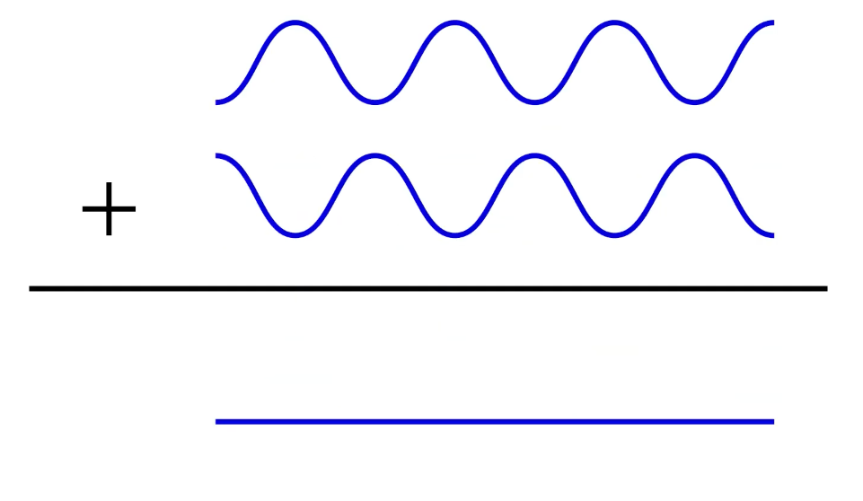

# Radio Communication

We now communicate wirelessly instead of through serial (fx). This introduces a lot of problems. 

Data is sent as a frame consisting of (generic, not a speicifc radio technology, but something you can usually find):
  

- Channel - Different kinds of communication happening over the same radio link (think of it as a port)
- Type - ACK, SYN - akin to those
- Source (who is sending)
- Destination (who is supposed to receive)
- Size (of payload), 6 bit = up 64 decimal. The payload can have a size of maximum 64 __bytes__
- Payload (data)
- CRC (cyclic redundancy check) - A hash, error correction

## Rules of the game

Radio waves are classified by their frequency on a spectrum.

Part of the spectrum is regulated other is open. An example of this is LoRa that uses 868MHz in EU and 915MHz in the US due to regulation.

 

Shorter waves travel longer but can carry less data, whereas longer waves are slower but can carry the most data (__given the same encoding and power consumption__).

An example of above is NFC. It operates at 13.56MHz which should give it a long range, however, due to the lower power, the range is very short.

## Spectrum

  

## Signal Strength

Signal is sent through the antenna.

Types of antennas:
- Omni-directional
- Directional

We can calculate the intensity of the distance using the inverse square law 
$$i \propto \frac{1}{d^2}$$

- **Consequence 1:** Signal drops polynomially with the distance
- **Consequence 2:** It's infeasible to send a signal over a long distance

## Performance

  

- More power = Less throughput and less range
- More throughput = Less power and less range
- More range = Less power and less throughput

**WILL BE IN EXAM**: place technologies in this space

## Noise

Signal recevied from the antenna is noisy.

**Noise floor** - The noise received when no signal is being transmitted

Every transmission is competing against the noise floor, thus we need to have a stronger signal to **be received**

SNR = Signal to noise ratio. 

When the ratio is violated we introduce errors in our transmissions as bitflips.

## Error correction (Redundancy checks)

__Analog radios__ do not have redundancy checks as they are analog.

RS-232 serial communication: 1 parity bit per character.

As packets are sent they have a CRC which is checked upon receival

## Reflection

Some materials absorb signals whereas others simply reflect them.

  

### Multipath

Consinder the following example.

  

We are sending data from the red dot to the black dot. However our signal is going to bounce off the wall resulting in the destination receiving the transmission twice __indirectly__. The two transmissions creates a **constructive interference**, doubling the amplitude of the wave:

However, if the same signals received are out of phase they can create **destructive interference**, cancelling each other out. (The waves are shifted in time)

  

## Shared media and Collisions

On a wireless neetwork, the recipients are restricted to those in range, thus the media is _shared_. Shared media makes it impossible to avoid collisions.

**Definition**: A collision happens when the signals of two (or more) packets overlap in time and space.

## Restrictions

Different network technologies use different frequencies and therefore have different restrictions that affects the:

- End-to-end latency
- Bandwidth
- Frame rate 
- Power envelope (how much energy does it take to communicate)
- And more...

## Network topologies

- **Line**: Instead of using longer range, we can use hops (devices that forward a signal) to communicate across a longer distance. May be more feasible more also introduces more room for error.
- **Star**: Usually the center one is a gateway
- **Ring**: Clockwise or counterclockwise
- **Tiered**: Each tier can be different kinds of devices. The center one could act as a gateway and be plugged into the wall. The 2nd tier center ones could be on battery on power and the leaves could be on solar power.
- **Tree**: May not be difference between nodes
- **Mesh**: The route is not fixed, it evolves.

  

  

## Acknowledgements

When is the ACK being sent?
1. After each frame
2. After each packet
3. When data is going in the opposite direction anyways

We can also have NACK - which is sent out when you expected to receive something, but didn't hear anything from the sender.

## OSI Model

  

## TinyOS (was)

Radio stack, basis for zigbee and thread:

Data is received in the CSMA and then forwarded up the stack. 