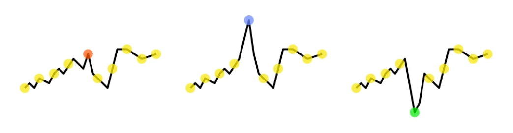
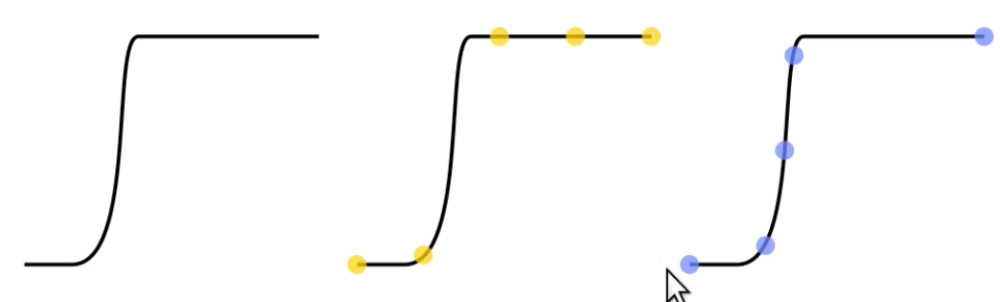
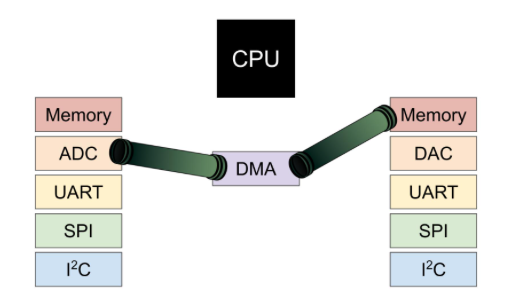
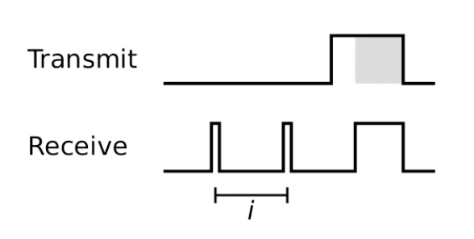

# Performance & evaluation

**Definition**: A budget represents the availability of a scarce resource

- A budget can be consumed (a battery)
- Some budgets can be replenished (battery that has a solar panel attached to it fx)
- Budgets can (depending on use case) be defining for the operation of a device

## Radio budget

Restrictions include:

- Number of pakcets sent throughout a day
  - Especially the case for Sigfox radios'
  - Consideration for LoRa
- Rate of transmission
- Maximum packet size

Consumers of packets:

- Data collection
- Actuation requests
- Configuration distribution
- Beacons
- Retransmissions
- Routing table maintenance

## Memory budget

- Available size of RAM
- Available size of ROM (read only memory) (program is stored here)
- Available size of Flash (fx a chip on the device, store locks)
- Amount of write cycles
- Size of erase unit (need to look this up)
    - Sometimes you can't just erase just one bit, but instead maybe 64 bytes. The result means that you have to load the data into memory you want to load data into ram (64 bytes), delete the bit within the data and replace it.

ROM and Flash have to be written to in a certain way. 

This affects:

  - What to place where
  - The process of storing data locally
  - The tradeoff between processing and data (put a lot of effort into data and cache it (we dont have to reprocess it), but that requires the space for caching)

## Processing budget

Restrictions include:

- Concurrency
- Processing speed
  - Integers
  - Single precision floats (32 bit)
    - Sign bit (1 bit)
    - Exponent (7 bit)
    - Fraction (24 bit)
  - Double precision floats (64 bit)
    - Sign bit (1 bit)
    - Exponent (11 bit)
    - Fraction (52 bit)

This affects:

- What can be done independently
- How data can be processed
- The tadeoff between processing and data

## Energy budget

Restrictions include:

- A battery limiting the energy available throughout the lifetime of the device
- A solar panel limiting the amount of energy which can be collection throughout a day. The rate of which the energy can be reclaimed depening on cloud coverage, temperature, time of day etc...
- A PSU limiting how much power can be drawn

Consumers of energy:

- CPU: off < sleeping < idling < processing
- Sensors and actuators: off <* on (only relevant if you can actually turn them on or off). Asterisk: not true, some sensors, fx light sensors are generating energy. Measures the amount of power that is being generated.
- Communication: off < sleep < (receive | transmit).
- **Usually**: simple sensors << CPU << comunication

# Management

## Data Throttling Techniques - Reconstructing the Signal

Typically, raw sensor values are transmitted

If for one reason or another you can't transmit a value you lose the ability to safely reconstruct the signal. 

Given the following example: 

  

The the first picture is the signal we received and the dots is when we ware sampling. If we lose the orange sample, then we can't tell if the 2nd or 3rd situation happened.

This could be due to:

- A dropped package
- A sudden need to send an additional package thus blowing the budget

## Sending Aggregate Values

Summerize data and send less.

We get:

1. A sum curve that grows indefinitely
2. Transmit the same number of values
3. Derive the original signal from the aggregate signal

If we lose a value the sginal degrades gracefuilly in temporal resolution.

## Adaptive Sampling

Sample sensor data periodically.

Requires a bandwidth proportional to the frequency.

- If we sample once every second -> one byte a second. We need something that can handlle 1 byte / second

This is often a good choice when the timing is important.

However, often not all values are equally important

Take the following example:

  

The last three dots are unimportant to us, as they are all telling the same (straighline), however with adaptive samping we instead sample when a change is occuring giving us a better indication of what is happening.

Example: Sample periodically, but only emit a value once it is signficantly different from the last emitted value.

## Batch Transmission

A common pattern is sample-transmit-sleep.

Procues a steady flow of data - with nice real-time properties.

Unfortunately this cause mostly empty packets to be transmitted, wasting potentially significant amounts of energy and/or radio budget. If possible we can instead increase the latency by waiting until a there is enough data to fill a packet. This causes the latency to increase to _n_ periods.

## Sleep Modes

The microcontroller and peripherals can operate in various power states.

Transitions between power states takes time.

When we go to a lower power state, we also decrease functionality. For example often the ADC wil be able to in in DMA mode, without the program counter spinning.

  

A DMA is a controller that allows data to bypass the CPU (prevents bottlenecking) and lets data from (fx) the ADC be moved directly to the memory of another peripherial. This is also useful if you want to batch some data, as it allows you to place the data directly in-memory bypassing the CPU until the 1000th sample when the CPU then can take care of it.

Keep track of requirements and only use the level that you actually need. 

## Low power listening

Running a radio in receive mode can be expensive. 

**Receiver**: Listens periodically for activity on the band and respond if found.

**Transmitter**: The transmitter will have to wait for the receiver to start listening. This is done by sending a lot of data in the beginning and hoping it hears back from the receiver, one it hears something it starts sending data. 

  

This is seen here. The white part in the transmit site is sychronization happening between the devices before data is sent.

# Managing the budget

1. Keep track of the remaining budget
2. Keep track of remaining time
3. Split the remaining time into sensible chunks (e.g. one per day)
4. Allocate part of the remaining budget to this chunk
5. Evaluate whether an event is worth processiung using the remainder of the budget allocated to the current chunk.

When something happens, we look at the budget allocated to this day (chunk). Are we ahead or behind of consumption? Is it worth processing this event? If not, then we don't -> event will be forgotten. 

However, we can take a note of each time we have dropped an event, thus we are aware of an increase in dropped events.