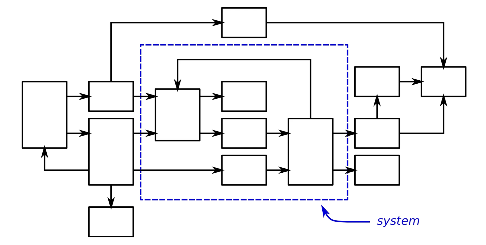
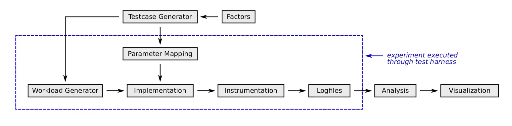

# Performance evaluation

We use the requirements to look at how well the implementation live up to them, and then we proceed to verification.

## Systems

Defintion: A system is a collection of independent components that have been combined in a particular configuration in order to solve some problem

It's not always feasible to test the entire system and thus we can replace some components with stubs instead. 

## Experimental computer science

when designing system we make decisions that we expect to have a positive outcome.

Usually based in non-functionl requirements and intuitions.

> The throughput of the system will gracefully degrade as the number of concurrent connections outnumber the number of physical CPU cores

> The introduction of the internet will increase the productivity of programmers

> The proposed networking topology between Odense and Copenhagen is able to drop limit the number of dropped UDP messages to 7% during the course of a typical day

Results are typically:

- Booleans - the results are true / false
- Float - to which degree is it true?
- Probabilistic - It is true 90% of the time

### Apparatus

The apparatus is the system under evaluation

Constructed to support conclusions on the hypothesis probability. 

It's inherently problematic when we experiment, since we introduce latency when we add code to measure latency (for example collecting timestamps and subtracting them and transmitting them as well).

#### Tests

Tests are conducted surrounding the apparatus, using an experimental. The tests can be carried out manually, but may is often not feasible. This is due to sampling size and repetition, thus automation is preferred.

#### Repeatability

The more repetition we get, the better the results -> better distribution -> more reproducable -> higher degree of trust in the result. 

This also allows us to highlight key true key characteristics.

## System definition

  

Despite the entire image being the system, one can still call the inner components that we are testing the system as well. We have input coming from the left side and output going out of the right side. 

Thus when testing we need the correct input. 

However, __what is the goal?__

We make choices to fulfill the goals.

Avoid bias: _Show that system A is better than system B_. is a bad goal, since each system may have different traits.

## Services

Could be:

- Route network packets to a gateway
- Insert a time x value sample into a database
- React to the production of a value from a sensor

Some service outcomes are desirable while others are not.

When performing an experiment we usually focus on a single service.

Kafa could fx expose multiple services:

- pushing data
- collecting data
- listing topics

## Metrics

Metrics are necessary when we want to quantify and compare results between multiple systems. 

Examples:

- _The delay is measured as the time it takes from the sensor reporting a value until that value is presented on the user's screen_
- _The memory consumption is measured as the resident memory allocated to the process of the gateway component_
- _The troughput is measured as the highest average frequency across 10s at which the database is capable of storing sensor readings_

Metrics are related to units. 

## Parameters

Usually, systems under experimentation are highly parameterized, and the observed results express how a configuration of these perform.

Fx:

- Buffer size
- Thread counts
- Timeouts
- Number of allowed retries

Likely constants in code or pulled from a configuration file.

Documenting these are key in order to reproduce results.

### Factors

Most of these parameters are static, but sometimes we wan't to tune some of the parameters. Thereby making it a _factor_ and experiment determining the best value.

Some factors may also have complex interactions with each other and examining all the combinations can be computially exhaustive.

## Workload

We need to produce multiple different forms of input into our system in order to validate that it works as intended. 

The data can be synthetic (faked) or historical data fed into the system. 

## Experimental design

It should

1. include the stubs necessary to execute the system as defined
2. operate instances of the relevant component according to fixed values for all parameters
3. include stub implementation for all dependencies to the system
4. produce the needed workload
5. iterate over relevant factors and workloads
6. instrument relevant components to observe and log relevant metrics
7. not influence the system under experimentation

Documenting the experimental design is key to any performance evaluation. 

**At least a block diagram and table listing all the parameters and the factors**. 

## Time

High-resolution timing is expensive

Two timestamps on a single machine are directly comparable. 

**The scheduler makes it almost impossible to do high-resolution timing** (unless youre in kernel space)

## Data analysis

Aslak usually ends up with two files:

- Timestamps of when different operations started and stopped
- Timestamps of metrics (networking, cpu usage, memory usage)

## Data presentation

Visualize the data! -> allows us to spot patterns and do a "sanity check", is something look incorrect?

## Summary

  